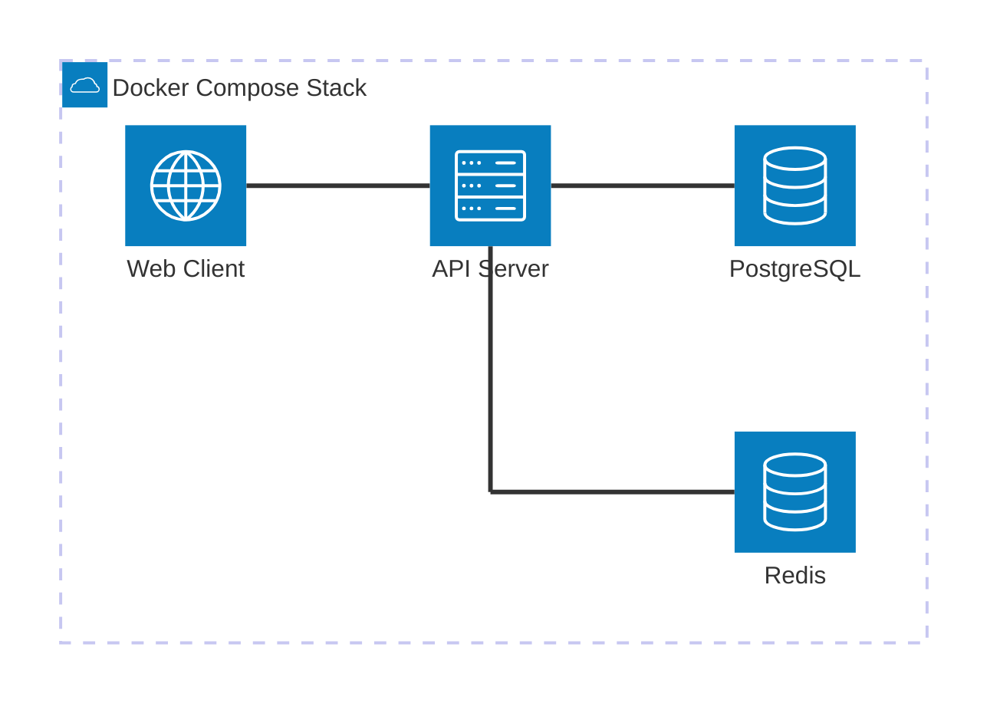

# Ssamantle (싸맨틀)

# 개요

싸맨틀은 단어 유사도 기반 추측 게임인 [시맨틀](https://semantle-ko.newsjel.ly/)을 **실시간 멀티 플레이** 가능하도록 확장한 버전입니다.

> [!note] 정보
> [시멘틀](https://semantle.com/)이란, Word2Vec 모델을 사용하여 제작된 단어 유사도 기반 추측 게임입니다.
> 한국어 버전 Fork 로 알려진 것으로 [꼬맨틀](https://semantle-ko.newsjel.ly/)이 있습니다.

# 아키텍처

프로젝트는 기능별로 분리된 컨테이너 기반 아키텍처를 채택하고 있습니다.



# 핵심 기능

| 기능          | 설명                                            | 비고               |
| ------------- | ----------------------------------------------- | ------------------ |
| 유사도 엔진   | FastText 기반 코사인 유사도(-1.0 ~ 1.0) 산출    | 한국어 모델 최적화 |
| 실시간 동기화 | 20~40인 동시 접속 및 실시간 스코어보드 업데이트 | 필드 테스트 완료   |
| 멀티플레이    | 단일 호스트 기반의 실시간 배틀 모드 지원        | V1 핵심 기능       |

[스크린샷 배치 권장]

- **게임 플레이 화면**: 단어 입력 시 유사도가 출력되는 메인 UI (우측 상단)
- **실시간 랭킹 화면**: 여러 사용자의 점수가 실시간으로 변동되는 대시보드 (좌측 하단)

---

# 로드맵과 개발 현황

프로젝트는 아래와 같이 V1 부터 V3 까지 3단계의 스프린트를 통해 구현하는 것을 목표로 하고 있습니다.

| 단계  | 상태      | 주요 목표                           | 핵심 키워드                       |
| --- | ------- | ------------------------------- | ---------------------------- |
| V1  | Done    | Core Engine & Single-Host Multi | FastText, WebSocket, 40인 테스트 |
| V2  | Todo    | Scalability & Authentication    | MSA, Multi-Host, Auth        |
| V3  | Backlog | Gamification & Launch           | 팀전, 아이템전, Open Source        |

현재 프로젝트는 V1 단계를 완료하였으며, 확장을 위한 V2 아키텍처 설계를 준비 중입니다.

# Quick Start (Deployment)

본 프로젝트는 서비스 실행을 위해 별도의 빌드 과정 없이 Docker Compose를 통한 배포를 권장합니다.

## 1.  배포 저장소 복제

```bash
git clone https://github.com/ssamantle/ssamantle-deploy
cd ssamantle-deploy
```

## 2.  환경 설정 및 실행

ssamantle-deploy 내의 가이드에 따라 환경 변수 및 모델 경로 설정 후, 아래의 명령 실행.

```bash
docker-compose up -d
```

---

# Tech Stack

| 요소       | 기술 스택                          |
| -------- | ------------------------------ |
| **Frontend** | TypeScript, React              |
| **Backend**  | Python, FastAPI                |
| **AI/ML**    | FastText (Word Embedding)      |
| **DevOps**   | Docker, GitHub Actions (CI/CD) |

# 비고

> [!TIP] 팁
> 
> (자치회에게) 이 프로젝트는 15기 1학기 자치회로서 SSAFY DAY 행사용으로 준비한 콘텐츠 입니다. 콘텐츠 선정 근거로는 아래와 같은 명분을 사용하였습니다.
> 
> AI 수업에서 배운 벡터 임베딩을 Gamification을 통해 체험할 수 있는 컨텐츠로, 자체 개발 플랫폼 상에서 반 전원이 15분간 실시간 단어 추측 배틀을 수행.
